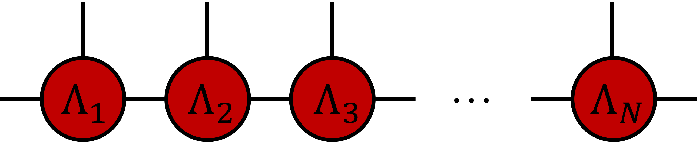
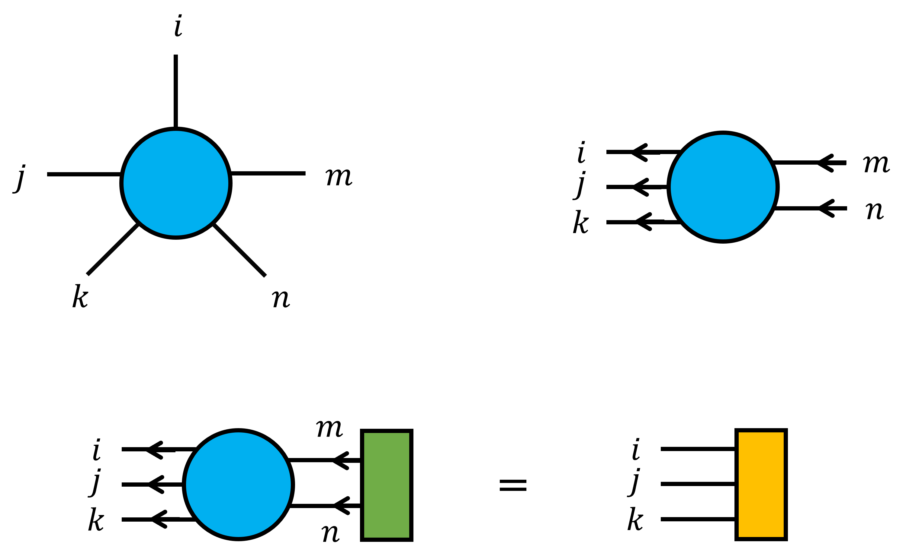
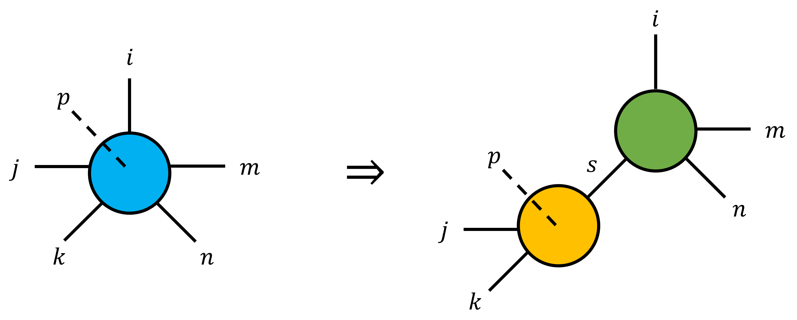
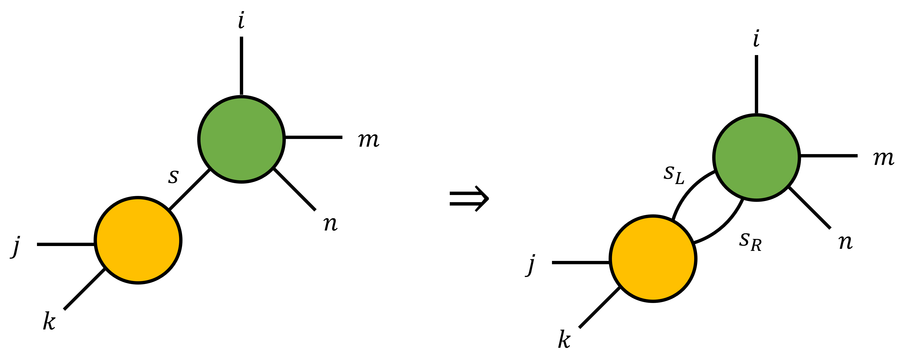
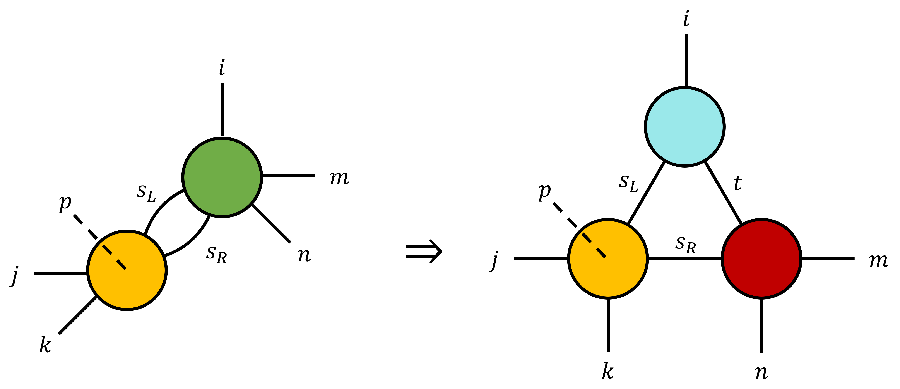

# isoTNS

## Canonical Matrix Product State (MPS)

Isometric Tensor Network State (isoTNS) is a generalization of canonical Matrix Product State (MPS).
For one-dimensional systems, their states can be written into an one-dimensional tensor network, namely, MPS.

<!-- a figure of MPS -->

Through SVD decomposition, any MPS can be turned to its canonical form with center $\ell$,
which is convenient for us to calculate site- $\ell$ expectation value.
Also, the center of canonical MPS can be moved to any site through a series of SVD decomposition.

## Isometry
Isometry is a property of maps.
Consider a map $A$ from Hilbert space $\mathcal{H}_1$ to Hilbert space $\mathcal{H}_2$ and its Hermitian conjugation $A^\dagger$.

$$
A:\mathcal{H}_1\to\mathcal{H}_2,\quad A^\dagger:\mathcal{H}_2\to\mathcal{H}_1
$$

If $A$ satisfies the following two conditions

$$
A^\dagger A=I_2,
$$

$$
AA^\dagger=P_1,
$$

then $A$ is a left isometric map,
where $I_2$ is the identity of Hilbert space $\mathcal{H}_2$ and $P_1$ is a projection operator of Hilbert space $\mathcal{H}_1$.
A map is right isometric when its Hermitian conjugation is left isometric.

A tesor can be treated as a linear transformation after we define input legs and output legs.

<!-- a 5-rank tensor as example -->

For a MPS, we can pick $n$ neighboring sites $V=m:m+n$, from $m$ to $m+n$.
Suppose that the physical legs are inputs, and the two ancilla legs on the boundaries are outputs.
Then, a linear transformation $T_{V\to\partial V}$ is defined.
The generalized definition of canonical form with center $\ell$ is that:
$T_{V\to\partial V}$ is isometric if $V=1:a$ for $a<\ell$, and
$T_{V\to\partial V}$ is isometric if $V=a:N$ for $a>\ell$.

For higher dimensional TNS, similar definition of canonical form can be given through this isometric criteria.
As an example, for 2D-TNS, each site has 2 indices and is denoted as $\Lambda^{ab}$.
A region of this TNS is denoted as $V=m:m+n,p:p+q$, which means the $m\leq a\leq m+n$ and $p\leq b\leq p+q$.
Take the physical legs as inputs and ancilla legs on the boundaries as outputs, the linear transformation $T_{V\to\partial V}$ is well-defined.
The conditions for this 2D-TNS to be canonical with center $(i,j)$ are that:

$T_{V\to\partial V}$ is isometric if $V=1:a,1:b$ for $a< i$, $b< j$,

$T_{V\to\partial V}$ is isometric if $V=1:a,b:M$ for $a< i$, $b>j$,

$T_{V\to\partial V}$ is isometric if $V=a:N,1:b$ for $a>i$, $b< j$,

$T_{V\to\partial V}$ is isometric if $V=a:N,b:M$ for $a>i$, $b>j$.

Under this definition, any site- $(i,j)$ expectation value can be calculated locally.

## Moses Move (MM)

Moses Move (MM) is an efficient way to shift the center of 2D canonical TNS with only one single sweep.
Here we describe this process for one column of 2D-TNS.

1.SVD decomposition.

2.Split the index $s$ into two indices $s_L, s_R$.

3.SVD decomposition.

